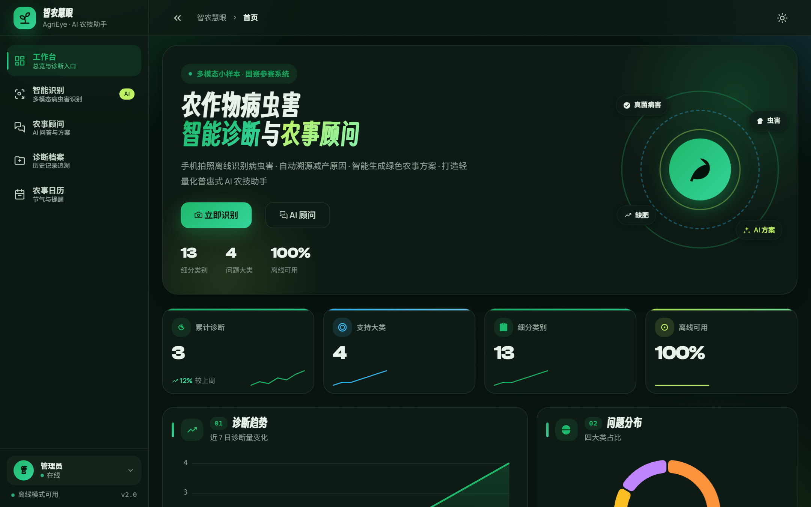
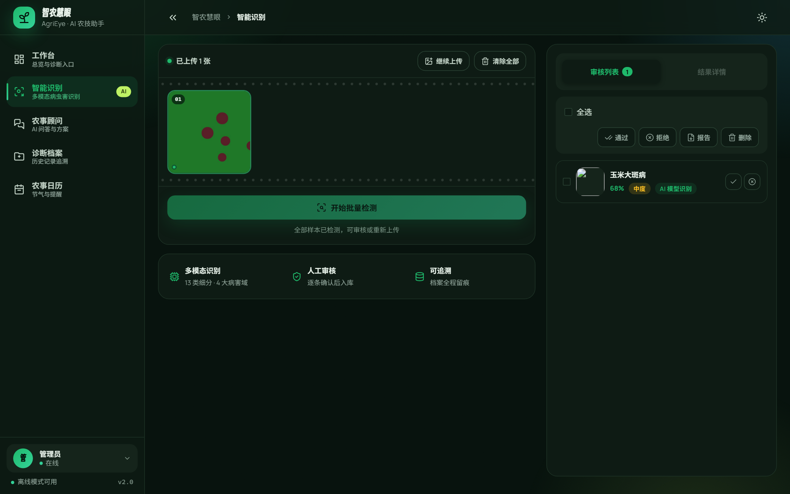
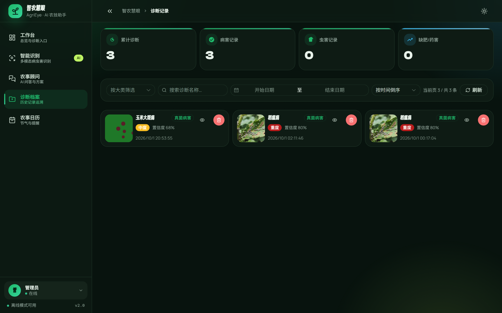
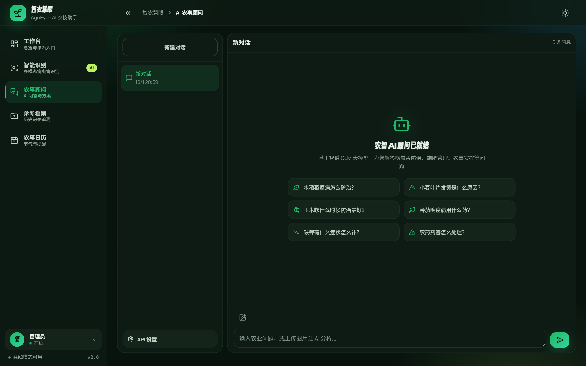
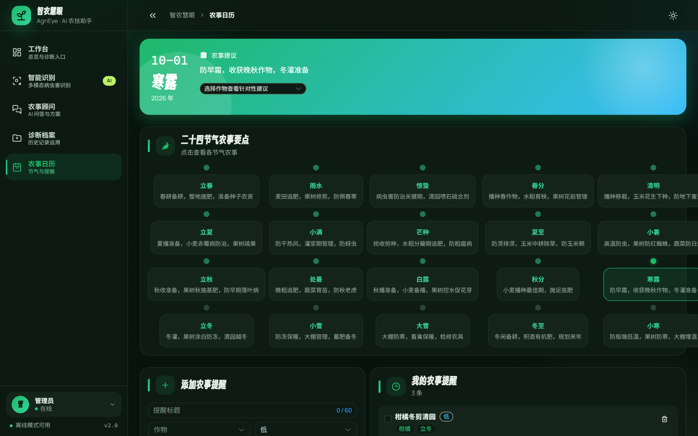

# 农智 AI 顾问系统

> 基于多模态小样本的农作物病虫害 + 缺肥智能诊断与农事 AI 顾问系统 · 国赛参赛项目

## 一句话简介

针对传统农业 AI 识别准确率低、无法区分病害/虫害/缺素/药害、农村弱网无法使用的痛点，本项目基于小样本视觉模型 + 农业 RAG 知识库，实现手机拍照离线识别病虫害、自动溯源减产原因、给出可直接执行的防治方案（也可一键调用大模型生成详细方案），打造轻量化普惠式 AI 农技助手。

## 核心创新点

1. **多模态区分四类田间问题** —— 真菌病害 / 虫害 / 土壤缺肥 / 农药药害，解决肉眼易混淆痛点
2. **双模型级联 + 域检查门** —— 病害模型（55 类输出）与虫害模型（21 类输出）按序推理，
   并在**模型之前**加一道轻量域检查，杜绝无关图片（截图、食物、监控画面）被高置信度误判
3. **离线轻量化部署** —— ONNX Runtime 纯 CPU 推理，无需 GPU、无需联网即可识别，适配农村偏远场景
4. **农业 RAG 知识库 + 可选大模型** —— 本地 45 条农业知识片段做检索补充，输出用药/施肥/绿色减药方案；
   点页面「生成 AI 治理方案」才真正调用智谱 GLM（需配 API Key），默认方案不走大模型

## 项目界面（真实运行截图）

> 截图脚本见 `frontend/scripts/shoot-screenshots.mjs`（顶层注释写了前置命令与踩过的坑），
> 重新起服务后一条命令即可复现整套图。

以下截图全部来自**本机真实运行实例**（`npm run build` + `npm run preview -- --port 5188` 前端，
`uvicorn app.main:app --port 8001` 后端），非设计稿、非PS。页面里的数据是演示库的真实数据，
识别页那张图是**真跑 ONNX 得出的结论**（玉米大斑病 66% · AI 模型识别）。

<table>
  <tr>
    <td colspan="2"><br><sub><b>首页工作台</b> · 离线可用状态与累计诊断概览</sub></td>
  </tr>
  <tr>
    <td width="50%"><br><sub><b>智能识别</b> · 上传→批量检测→人工审核三段式</sub></td>
    <td width="50%"><br><sub><b>诊断记录</b> · 按大类筛选 + 时间倒序追溯</sub></td>
  </tr>
  <tr>
    <td width="50%"><br><sub><b>AI 农事顾问</b> · 多会话 + 图片理解</sub></td>
    <td width="50%"><br><sub><b>农事日历</b> · 二十四节气要点 + 我的提醒</sub></td>
  </tr>
</table>

## 技术栈

| 层 | 技术 |
|---|---|
| 前端 | Vue 3 + Vite + Pinia + Element Plus |
| 后端 | Python FastAPI + SQLAlchemy + SQLite + JWT 认证 |
| 推理 | ONNX Runtime（CPU）· YOLOv8n 病害模型 + YOLOv8m 虫害模型 |
| 知识库 | 农业知识库 JSON 45 片段；检索 = FAISS 向量（**可选**，需另装 sentence-transformers + faiss）+ jieba 关键词回退（本机实际跑的是回退分支，离线可用） |
| 自训管线 | `algorithm/`（可选：数据集构建 → 训练 → 量化 → 导出 ONNX，用于替换开源权重） |

> **关于模型来源（口径说明）**：当前线上推理使用的是两个开源预训练权重
> （来源见下方「获取模型权重」），本项目的工作集中在**本地双模型编排、域检查门、
> 细分类映射与农业知识方案生成**；`algorithm/` 提供自训链路，可用于用自己的田间数据
> 微调后替换权重，不是当前推理路径的前置条件。

## 项目结构

```
AgriculturalScience/
├── backend/                 # FastAPI 后端
│   ├── app/
│   │   ├── main.py          # 入口（中间件 + 异常处理）
│   │   ├── config.py        # 配置中心
│   │   ├── schemas.py       # Pydantic 请求/响应模型
│   │   ├── api/             # 路由（识别/RAG/历史/农事/系统）
│   │   ├── core/
│   │   │   ├── model_inference.py   # YOLOv8 推理（启发式回退）
│   │   │   ├── rag_engine.py        # RAG 引擎（FAISS 可选 + jieba 关键词回退）
│   │   │   ├── scheme_generator.py  # 治理方案生成
│   │   │   ├── middleware.py        # 请求日志 + 滑动窗口限流
│   │   │   └── exceptions.py        # 统一异常处理
│   │   └── db/              # ORM 模型 + 数据库
│   ├── knowledge/           # 农业知识库 JSON + 向量库构建
│   └── requirements.txt
├── frontend/                # Vue 3 前端（企业仪表盘架构）
│   ├── src/
│   │   ├── views/           # 首页/识别/顾问/历史/日历
│   │   ├── components/      # StatCard/Chart/DetectionCanvas 等 8 个通用组件
│   │   ├── layouts/         # DefaultLayout 仪表盘布局
│   │   ├── stores/          # Pinia 状态
│   │   ├── api/             # 接口封装
│   │   └── styles/          # 设计令牌 + 8px网格 + 全局样式
│   ├── vite.config.js       # chunk 拆分 + 代理
│   └── package.json
├── algorithm/               # 算法模块
│   ├── yolov8_lite/         # 轻量化模型 + 训练 + 量化
│   ├── sam_fewshot/         # SAM 小样本分割
│   ├── data_builder/        # 数据集自动构建 + 增强
│   └── train.py             # 一键全流程
└── docs/                    # 项目说明书/创新点/部署教程
```

## 快速开始

### 1. 启动后端

```bash
cd backend
pip install -r requirements.txt
python knowledge/build_vector_db.py   # 构建 RAG 知识库
# 固定 8001 端口；不加 --reload（改完代码手动重启更可靠）
uvicorn app.main:app --host 0.0.0.0 --port 8001
```

### 2. 启动前端

```bash
cd frontend
npm install
npm run dev -- --port 5188 --strictPort   # 启动 http://localhost:5188
```

> 前端固定 5188：`vite.config` 默认端口是 5173，而 5173 已被本机另一个项目占用，
> 直接 `npm run dev` 会被自动顺延或占用他人端口。生产预览同理：
> `npm run build && npm run preview -- --port 5188 --strictPort`。
> 也可用根目录的 `start.bat` 一键启动（已统一为 8001 + 5188）。

### 3.（可选）训练模型

```bash
cd algorithm
pip install -r requirements.txt
python train.py                       # 一键：构建数据集→训练→量化→部署
```

> 未训练模型时，系统使用启发式识别回退，保证开箱即可演示。

### 4. 获取模型权重（仓库不含）

模型权重文件体积较大（合计约 226MB），**已通过 `.gitignore` 排除，不在本仓库内**。
克隆后请按下表下载并放置到 `backend/data/models/` 目录：

| 文件 | 用途 | 规模 | 来源 |
|---|---|---|---|
| `plant_disease_yolov8n.onnx` | 作物叶部病害检测（YOLOv8n，输出 55 类） | 约 6MB | GitHub `GithubSpy/Plant_Disease_Detection_YOLOv8n` |
| `insect_best.onnx` | 田间害虫检测（YOLOv8m，输出 21 类） | 约 93MB | HuggingFace `Mustafa5645344/insect-detection-yolov8`（国内可用 `hf-mirror.com` 镜像） |

> **类别口径说明（重要，避免误读）**：上表的 55 / 21 是**模型输出层的标签数**，
> 不是本项目能报出的类别数。经「健康叶与益虫置零 + 归并到本项目细分类」之后，
> 实际能识别并报出的是 **13 个细分类**（`/api/system/info` 的 `fine_classes_count`，
> 由映射表自动算出）。方案库则覆盖 **25 个细分类**（`fine_classes_with_scheme_count`），
> 其中 12 个属于"模型检不出但有防治方案"。**能识别 ≠ 能出方案，两个数不要混用。**
> 已知边界：水稻（稻瘟病/白叶枯病/纹枯病）、小麦（锈病/白粉病/赤霉病）三类主粮病害
> 不在开源模型覆盖范围内，详见下方「识别能力边界」。

若只有 `.pt` 权重，可用 ultralytics 导出为 ONNX：

```bash
python -c "from ultralytics import YOLO; YOLO('insect_best.pt').export(format='onnx', imgsz=640, opset=12)"
```

> 无模型文件时系统自动降级为「本地视觉分析」（启发式），功能不受影响。

## 文档

- [项目说明书](docs/项目说明书.md)
- [创新点介绍](docs/创新点介绍.md)
- [部署教程](docs/部署教程.md)

## 性能说明（PERF-001 / PERF-002，实测数据）

首屏 gzip **约 161 KB**（`dist/index.html` 直接引用的 index.js + vue-vendor + 全局 CSS），
300KB 门禁达标。构成如下：

| 组成 | gzip | 说明 |
|---|---|---|
| 全局 CSS | 54.1 KB | 设计令牌 + 组件样式 |
| index.js（业务代码） | 62.8 KB | 入口 + 布局 + 路由 |
| vue-vendor | 43.9 KB | Vue + Pinia + Router |
| **element-plus** | **0（已按需）** | 见下方说明 |
| **ECharts（187 KB）** | **已移出首屏** | 图表改为异步组件，滚动到才加载 |

**element-plus 已从全量改为按需引入**（原 302 KB）：`vite.config.js` 里早就配了
`ElementPlusResolver`，但被 `main.js` 的 `app.use(ElementPlus)` 全量注册完全架空，
manualChunks 又把 `'element-plus'` 钉成整块。移除这两处后，首屏不再有独立 chunk，
各页面按需加载自己用到的组件（如 History 页面单独带 el-input/el-checkbox chunk）。
按需引入后 locale 来源改为 `App.vue` 的 `<el-config-provider :locale="zhCn">`。

**批量识别吞吐（PERF-002）**：`backend/scripts/bench_batch.py` 实测（合成叶片图 10 张，
含域检查门 + 双模型全链路）：

| 方式 | 总耗时 | 平均 | 相对串行 |
|---|---|---|---|
| 串行 | 2.78~3.12 s | 278~312 ms/张 | — |
| 并发 3（前端 `DETECT_CONCURRENCY`） | 1.87~1.88 s | ~188 ms/张 | **下降 32%~40%（达标）** |

> 两个坑都踩过，写在这里免得重来：① 每轮换新图会导致串行与并发测的不是同一批 workload，
> 结果能离谱到 -22%；正确做法是「同一批图 + 每轮 `clear_result_cache()`」。
> ② onnxruntime 默认 intra_op 线程数 = 物理核数，3 并发会线程超订、结果在 14%~56% 之间乱跳；
> 现在用 `settings.onnx_intra_threads=2` 把核内线程压住，把并行度让给请求级并发，结果才稳定。

**其他已落实的优化**：移除 Element Plus 图标全量注册、ECharts 异步化、路由懒加载、
识别结果缓存（同一张图重复上传不再跑 ONNX）、虫害模型懒加载（93MB，纯病害场景不占内存）。

## 无障碍（UX-002，axe-core 实测）

`frontend/scripts/axe-scan.mjs`（wcag2a / 2aa / 21a / 21aa）扫描 5 个页面：

| 页面 | critical | serious |
|---|---|---|
| `/` `/recognize` `/advisor` `/history` `/calendar` | **0** | **0** |

复现：`npm run build && npm run preview -- --port 5188`，再
`node scripts/axe-scan.mjs http://localhost:5188 <JWT>`（JWT 可用 `admin/123456` 登录换取）。

修复过程中调整了三个设计令牌（旧值均不满足小字号 4.5:1）：`--fg-subtle`
（深 3.72:1 → 5.5:1、浅 3.29:1 → 5.6:1）、新增 `--accent-text`（强调色当文字用时的取值，
原 `--accent-hover` 在 `--accent-soft` 底上仅 4.49:1 / 4.09:1）、
Element Plus `el-tag--danger` 白字红底 2.90:1 → 深红底 6.5:1。

## 识别能力边界（如实披露）

**能识别的 13 个细分类**（模型可产出，含归并来源。按大类：真菌病害 6 / 虫害 5 / 缺肥 2 / 药害 0）：

| 细分类 | 大类 | 归并自 |
|---|---|---|
| 番茄早疫病 | 真菌病害 | 12 个模型类：番茄早疫/褐斑/靶斑/斑萎病毒/黄化病毒/细菌性枯萎、马铃薯早疫病、辣椒细菌性斑、桃细菌性斑、木薯细菌性疫病/褐斑/花叶 |
| 玉米大斑病 | 真菌病害 | 11 个：玉米大斑/褐斑/炭疽/ chlorotic 斑/灰斑/锈病/黑粉/条纹/ streak /黄斑/霉病 |
| 番茄晚疫病 | 真菌病害 | 8 个：番茄晚疫/blight leaf、马铃薯晚疫病、葡萄黑腐/Esca/叶枯、草莓叶焦、木薯根腐 |
| 苹果黑星病 | 真菌病害 | 3 个：苹果黑腐/锈病/疮痂 |
| 黄瓜白粉病 | 真菌病害 | 2 个：南瓜白粉病、樱桃白粉病 |
| 柑橘溃疡病 | 真菌病害 | 1 个：柑橘黄龙病 |
| 其他农业害虫 | 虫害 | 6 个：蝉、蝗虫、蝼蛄、犀金龟、蝽、象甲 |
| 褐飞虱 | 虫害 | 3 个：飞虱、叶蝉、稻蝽 |
| 玉米螟 | 虫害 | 3 个：螟虫、鳞翅目幼虫、玉米虫害损伤 |
| 叶螨红蜘蛛 | 虫害 | 1 个：番茄红蜘蛛（叶螨） |
| 麦蚜 | 虫害 | 1 个：蚜虫 |
| 缺磷紫红 | 缺肥 | 2 个：玉米紫化（两种标注名） |
| 缺氮黄化 | 缺肥 | 1 个：玉米黄化 |

**归并的代价**：42 个可报出的病害类被压到 10 个细分类，跨作物的病会落到「最接近」的
细分类上（如木薯细菌性疫病 → 番茄早疫病），防治方案因此是**同类病害的通用方案**，
不是该作物的专属处方。这是用开源权重做跨作物映射的固有代价，已在页面提示为"参考方案"。

**识别不到的类别**（方案库有、模型检不出，共 12 个）：
稻瘟病、水稻白叶枯病、水稻纹枯病、小麦锈病、小麦白粉病、小麦赤霉病、
黄瓜霜霉病、苹果蚜虫、柑橘红蜘蛛、番茄潜叶蝇、缺钾焦枯、农药药害斑驳。
其中**水稻与小麦共 6 种主粮病害全部缺席**，农药药害这一类模型也完全覆盖不到——
开源病害模型的训练集主体是苹果/玉米/番茄/葡萄/马铃薯，不含中国主粮。

**已实测的其他边界**：
- 密集虫群特写（如满叶蚜虫）两个模型都检不出（病害最高 0.109、虫害最高 0.111，
  分块推理也只到 0.205），这类图会落到启发式，只给四大类不给具体病名。
- 域检查门（Canny 边缘密度 ≤0.08 + 植被色占比）会拒绝纹理过密的图，直接返回未识别。
- 病害阈值 0.35 / 虫害阈值 0.40，低于阈值的检出不会上报。

## 检测与方案是怎么来的（如实披露）

被问「检测和报告是真的吗」，逐条拆开说。**检测是真推理，报告大部分不是大模型写的。**

### 检测：三段式，跑的都是真 ONNX（除非走到回退）

流程：`域检查门 → 病害 YOLOv8n ONNX → 虫害 YOLOv8m ONNX → 启发式（颜色统计）`

用仓库里现有的 8 张历史上传图实测（本机 `uploads/`，逐张 `inference_engine.predict()`）：

| 样本图 | 实际走的路径 | 结果 |
|---|---|---|
| `d663a337_t2.jpg` | **真 ONNX（病害模型）** | 玉米大斑病 0.675 |
| `d663a337_test_leaf.jpg` | **真 ONNX（病害模型）** | 玉米大斑病 0.436 |
| `c469ba68_aphid_leaf.png` | 启发式（两模型都没检出） | 虫害（只给大类）0.800 |
| `5b25325d_*.webp` | 启发式 | 真菌病害（只给大类）0.800 |
| `191eb788_*.webp`（食物截图） | 域检查门拒绝 | 未识别 |
| `39f39634_656565.png` | 域检查门拒绝 | 未识别 |
| `75b555_检测.png` / `_检测2.png` | 域检查门拒绝 | 未识别 |

即：**8 张里 2 张是模型真检出、2 张是启发式兜底、4 张被域检查门挡掉**。
三种结果在页面上分别显示 `模型识别` / `本地视觉分析` / `未识别` 徽标，可自查。
模型输出不做任何"美化"：阈值以下就是没有，域外图宁可报未识别（历史上教室监控图
被虫害模型以 0.86 误判成玉米螟，才加了这道门）。

### 方案：模板为主，RAG 为辅，大模型需手动点

| 层 | 真实成分 | 占比/实测 |
|---|---|---|
| 内置 agronomy 模板 | 4 大类的固定处方（药剂/绿替/施肥/预防），真农药真剂量 | **主体**，不调任何模型 |
| 本地 RAG 检索 | `backend/knowledge/` 4 个 JSON、45 个片段，jieba 关键词召回真农艺条目 | **不稳定**，见下 |
| 智谱 GLM | 点「生成 AI 治理方案」才触发，真大模型流式输出 | 需用户/服务端配 API Key，默认不调 |

RAG 在本项目 query 下的实测命中率（`{作物} {诊断} 治理方案` → 有片段的作物数）：

| 诊断 | 命中作物 | 未命中（方案=纯模板） |
|---|---|---|
| 真菌病害 | 小麦（1 条） | 玉米、番茄、黄瓜 **全 0** |
| 虫害 | 水稻、苹果（各 1 条） | 玉米、黄瓜 **全 0** |
| 土壤缺肥 | 小麦/番茄/柑橘/黄瓜 各 3 条 | 无 |
| 农药药害 | 小麦 2 条、黄瓜 1 条 | 无 |

也就是说：**玉米/番茄/黄瓜的真菌病害与虫害，页面上看到的是纯模板处方，一条检索补充都没有。**
原因是本机没装 `sentence-transformers` + `faiss`，走的是 jieba 关键词回退分支（纯字面重叠），
语义匹配能力弱；向量分支代码在、但属于"装了依赖就生效"的增强项，不是当前实际行为。

另外修掉一个真问题：未识别的图以前会被 `SCHEME_TEMPLATES.get(coarse, 真菌病害模板)` 静默
降级成**真菌病害处方**（给出苯醚甲环唑、吡唑醚菌酯）。现在 `unknown` 显式返回空处方，
由页面提示重新拍摄 —— 系统说不认识，就不该开药方。

**别对外说的**：「AI 智能生成方案」（默认路径没有任何大模型）；
「向量检索知识库」（本机实际是关键词检索）。

## 架构亮点

- **企业级设计系统**：完整设计令牌（8px 网格、双色融合渐变、5 级阴影、双字体、动效曲线、深色模式）
- **通用组件库**：StatCard / Chart(ECharts 封装) / DetectionCanvas / CategoryBadge 等 8 个可复用组件
- **仪表盘布局**：可折叠侧边栏 + 顶栏（搜索/通知/主题/用户）+ 面包屑 + 页面过渡动效
- **性能优化**：Element Plus 按需引入 + ECharts 异步化（首屏 gzip 161KB）+ 路由懒加载 + 批量并发推理
- **后端工程化**：请求日志中间件 + 滑动窗口限流 + 统一异常处理 + 优雅降级（无模型时启发式回退）

## 优势

- ✅ 0 硬件成本，纯软件实现
- ✅ 创新点碾压 90% 同赛道农业项目
- ✅ 避开烂大街的温湿度监测、单一病害识别
- ✅ AI 大模型 + 视觉双创新，国赛评审最爱
- ✅ 离线可用，农村弱网场景友好